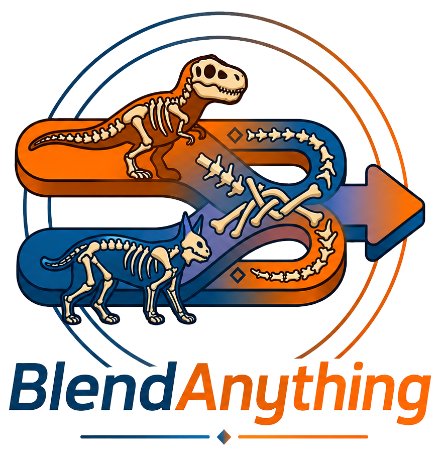
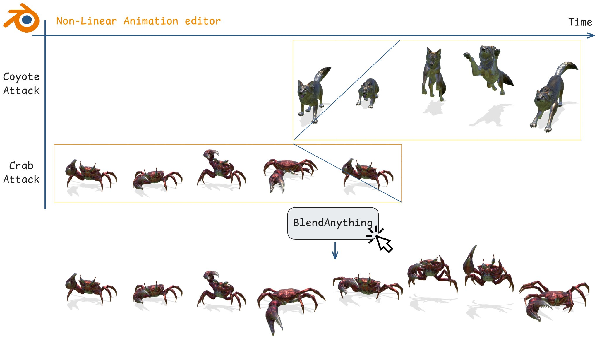

<div align="center">



**Neural motion blending & retargeting — straight from Blender's NLA Editor.**

[](https://mmlab-cv.github.io/BlendAnything/)
[](https://mmlab-cv.github.io/BlendAnything/)
[](https://www.blender.org/)
[](https://github.com/mmlab-cv/BlendAnything)

**[Luca Cazzola](https://scholar.google.com/citations?user=fsnsqoYAAAAJ)<sup>1</sup> ·
[Giulia Martinelli](https://scholar.google.com/citations?user=WG3OkQ4AAAAJ)<sup>1,2</sup> ·
[Nicola Conci](https://scholar.google.com/citations?user=mR1GK28AAAAJ)<sup>1,2</sup>**
<br><sub><sup>1</sup> University of Trento · <sup>2</sup> CNIT · [MMLab](https://github.com/mmlab-cv)</sub>



[Project site](https://mmlab-cv.github.io/BlendAnything/) ·
[Usage](docs/usage.md) · [API](docs/api.md) ·
[Architecture](docs/architecture.md) · [Skeletons](docs/skeletons.md)

</div>

<br>

## ✨ What it does

Blender's NLA Editor becomes the front-end for a motion-processing server.
Select one **reference** strip and one or more **target** strips; the add-on
ships them to a local or remote server for neural **blending** or
**retargeting** — even across different skeletons — and imports the result
back into your scene as a ready-to-use NLA strip.

| | |
|---|---|
| 🧩 **Cross-topology** | Blend or retarget between mismatched skeletons (Truebones, Mixamo, or custom) |
| 🎚️ **Per-strip weights** | Linked crossfades or independent strength envelopes on native `influence` curves |
| ⚡ **Non-blocking** | Progress-aware jobs polled once/sec — Blender never freezes |
| 🔌 **Swappable models** | Load any checkpoint from the server's catalog at runtime |

<br>

## 🎉 News

#### Milestones

* **12/06/2026** — First code release!

#### Coming soon

* Poster abstract
* Better models (for better blending 😉)


<br>

## 🚀 Quick start

### 1 · Clone the repository

Clone BlendAnything recursively so the Neural Motion Blending submodule is
downloaded at the same time:

```bash
git clone --recursive https://github.com/mmlab-cv/BlendAnything.git
cd BlendAnything
```

### 2 · Download the models

Download
[`blendany_model_weights.zip`](https://drive.google.com/drive/folders/1LX4r0hspvJP8jax6wYB67mLf5yKuUY4Z?usp=drive_link)
and extract its model folders into:

```text
BlendAnything/
└── neural_motion_blending/
    └── save/
        └── truebones_attnpool/
            ├── args.json
            └── model*.pt
```

The server discovers model folders under
`neural_motion_blending/save/`. Each model folder must contain exactly one `model*.pt` checkpoint.

### 3 · Server Setup

```bash
conda env create --file neural_motion_blending/environment.yml
conda activate neural_motion_blending
pip install -r blendanything_server/requirements.txt
pip install --no-build-isolation git+https://github.com/inbar-2344/Motion.git
```

Then start the server

```bash
uvicorn blendanything_server.app:app --reload
```

> Starts by default at `localhost:8000`

### 4 · Client Setup

1. **Install** — zip the `blendanything_client/` directory and install that zip
   in Blender.
2. **`requests`** — if missing from Blender's Python:
   `<blender-python> -m pip install requests`
3. **Configure** — set the Server URL in the Neural Blend panel
   (default `http://localhost:8000`); click the globe to verify.
4. **Go** — open the NLA Editor → **N-panel → Neural Blend → Import BVH**,
   arrange strips, then **Run Neural Blend**.

> 💡 A few ready-to-use BVH clips ship in [`samples/`](samples/) (e.g. Truebones
> Elephant, Skunk, Coyote, Crab) so you can try a blend right away.

Full walkthrough in **[docs/usage.md](docs/usage.md)**.

<br>

## 📚 Documentation

| Doc | Contents |
|---|---|
| **[Usage & UI](docs/usage.md)** | Workflow, modes, panels, strength profiles, DDIM policy |
| **[Skeletons](docs/skeletons.md)** | Skeleton selection, face joints, custom / OOD skeletons, conditioning |
| **[API](docs/api.md)** | Endpoints, request payload, progress phases, result delivery |
| **[Architecture](docs/architecture.md)** | Project layout, data flow, extending |

Each package also has its own README:
[client](blendanything_client/README.md) ·
[server](blendanything_server/README.md) ·
[devtools](devtools/README.md) · [data](data/README.md)

<br>

## 🧱 System requirements

The Blender client and neural server may run on different computers.

| Component | Requirement |
|---|---|
| **Blender client** | Blender **4.5.4 LTS**. The add-on otherwise follows Blender's supported desktop operating systems. |
| **Server OS** | **Linux x86-64** recommended and used by the provided environment. Native Windows and macOS server setups are not currently validated. |
| **Server Python** | **Python 3.8.15**, matching `neural_motion_blending/environment.yaml`. |
| **GPU** | An **NVIDIA CUDA-capable GPU** is required by the current inference path. The reference environment uses **CUDA 12.1** and PyTorch **2.4.1**. |
| **Storage** | Space for the repository, model checkpoints, T5 assets, temporary BVH files, and generated motions. |
| **Network** | The Blender client must be able to reach the server URL. Internet access is needed for the initial repository, dependency, model, and T5 downloads. |

GPU memory use depends on the selected checkpoint and motion length. CPU-only
inference and Apple Silicon/MPS are not currently supported release
configurations.

<br>

## 🙏 Credits & acknowledgements

- **[Neural Motion Blending](https://mmlab-cv.github.io/neural_motion_blending/)** —
  the cross-topology neural model powering BlendAnything, vendored as the
  `neural_motion_blending` git submodule.
- **[AnyTop](https://anytop2025.github.io/Anytop-page/)** — the any-skeleton
  motion-generation work the model builds upon.
- **[Truebones](https://truebones.gumroad.com/)** — source of the Truebones
  animal-skeleton motion data used for training and conditioning.
- **[Mixamo](https://www.mixamo.com/)** (Adobe) — source of the Mixamo humanoid
  skeletons and motions used for training and conditioning.
- **[Blender](https://www.blender.org/)** — the host application; the add-on
  lives in its Non-Linear Animation editor.
- **[Motion](https://github.com/inbar-2344/Motion)** — BVH read/write/edit
  library used by the server.

Datasets, model checkpoints, and any derived metadata remain subject to the
licenses and distribution terms of their original sources.

<br>

## 💜 Cite Us 💜

If you use this work, please cite the SIGGRAPH Posters 2026 paper.

```bash
COMING SOON!
```